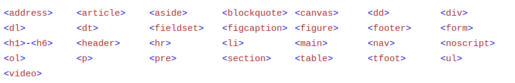
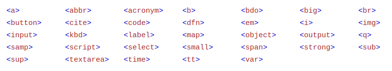

# Block and Inline
- Elements with different `display` property values have subtly different box models.

## Block vs Inline vs Inline-Block
- Block elements, whose default style is `display: block`, appear on the page stacked atop each other, with each element starting a new line.
- Inline elements, whose default style is `display: inline`, do not start on a new line. Padding and margin do not work well on inline elements.
- Inline-block elements, whose style is `display: inline-block`, behave like inline elements, but they have block-style padding and margin.

## List of Block Elements in HTML

## List of Inline Elements in HTML
